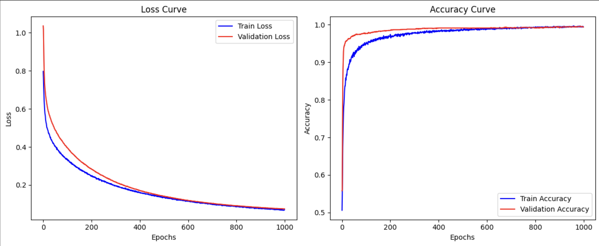
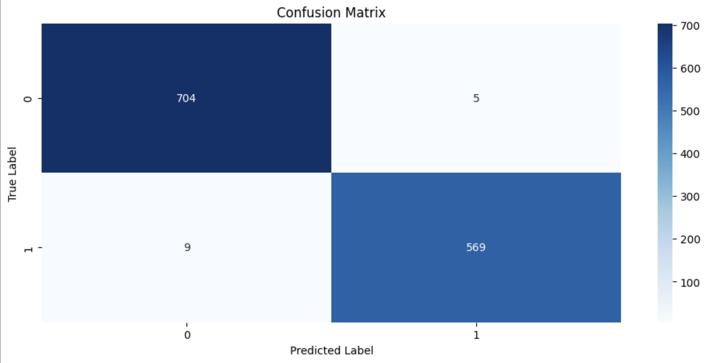
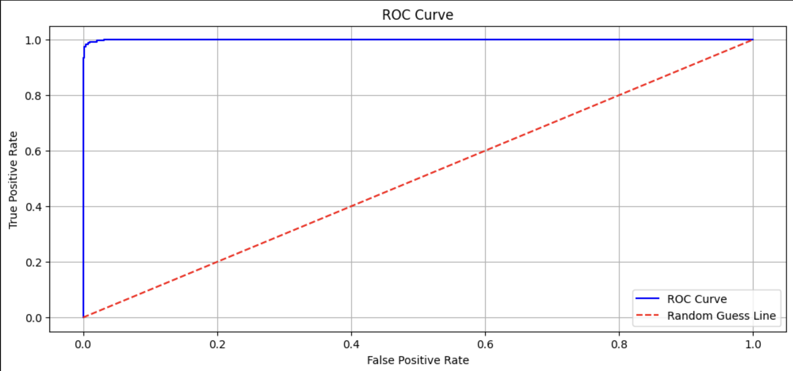

# Hi, I'm Haris! 👋

[](https://choosealicense.com/licenses/mit/) 

# Neural Network

The repository contains the following files:

* **NeuralNetwork.ipynb** – contains code for training and evaluating the neural network model
* **NeuralNetwork.py** – corresponding .py file for the neural network model
* **data.zip** – a zip folder containing 8580 CT scan images
* **labels.csv** – contains labels for each image in the data.zip folder

## Table of Contents

1. [Introduction](#introduction)
2. [Installation Requirements](#installation-requirements)
3. [Assignment Overview](#assignment-overview)
4. [Data](#data)
5. [Training and Evaluation](#training-and-visualization)
6. [Screenshots](#screenshots)
   
## Introduction

This assignment centers around building and training a **Neural Network** to classify medical images, specifically **CT scan slices**. Neural networks are a core component of modern deep learning systems, inspired by the human brain. They consist of interconnected layers of artificial neurons that learn patterns from data by adjusting internal weights through a process called **backpropagation**. Neural networks excel at modeling complex, non-linear relationships and are particularly effective for tasks like **image classification**, **speech recognition**, and **natural language processing**.

The code is organized into a detailed **Jupyter Notebook (`NeuralNetwork.ipynb`)**, with an equivalent script version provided in `NeuralNetwork.py` for modular execution.


## Installation Requirements

To run the notebooks in this repository, you will need the following packages:

* `numpy`
* `pandas`
* `matplotlib`
* `scikit-learn`
* `seaborn`
* `torch`
* `PIL`


You can install these packages using pip:

```bash
pip install numpy
```

```bash
pip install pandas
```

```bash
pip install matplotlib
```

```bash
pip install scikit-learn
```

```bash
pip install seaborn
```

```bash
pip install torch
```

```bash
pip install PIL
```

After installing the required libraries, run the **"Imports"** cell in the notebook to begin.

Useful Links for installing Jupyter Notebook:
- https://youtube.com/watch?v=K0B2P1Zpdqs  (MacOS)
- https://www.youtube.com/watch?v=9V7AoX0TvSM (Windows)

It's recommended to run this notebook in a conda environment to avoid dependency conflicts and to ensure smooth execution.
Also, you will need a GPU to run the notebooks. It is recommended to have a Google Colab Account (perhaps multiple accounts) for this purpose.
<h4> Conda Environment Setup </h4>
<ul> 
   <li> Install conda </li>
   <li> Open a terminal/command prompt window in the assignment folder. </li>
   <li> Run the following command to create an isolated conda environment titled AI_env with the required packages installed: conda env create -f environment.yml </li>
   <li> Open or restart your Jupyter Notebook server or VSCode to select this environment as the kernel for your notebook. </li>
   <li> Verify the installation by running: conda list -n AI_env </li>
   <li> Install conda </li>
</ul>


## Assignment Overview

The `NeuralNetwork.ipynb` notebook presents a complete pipeline for building, training, and evaluating a neural network to classify CT scan images based on provided labels. 

### 1. **Data Loading and Preprocessing**

The assignment begins by loading a dataset of **8,580 CT scan images** stored in the `data.zip` archive. The corresponding labels are read from `labels.csv`, which maps each image to its class (e.g., healthy vs diseased). 

### 2. **Neural Network Architecture**

A simple **feedforward neural network**  is defined to process the image data. 

### 3. **Model Training**

The notebook trains the neural network using:

* A **loss function**,
* An **optimizer**,
* Multiple **epochs**, each looping over the training data to minimize the loss.

During training, the model’s **loss** and **accuracy** are tracked, and visualized using plots to observe learning progression.


### 4. **Evaluation and Testing**

After training, the model is evaluated on a held-out **test dataset**. 


## Data

The dataset used in this assignment consists of **medical CT scan images** stored in a compressed folder `data.zip` and labeled using the file `labels.csv`. The objective is to build a neural network model that can classify each scan image into a specific category — such as distinguishing between **healthy** and **infected** patients — based on visual patterns in the CT scans.

### `data.zip` — CT Scan Images

* This archive contains **8,580 CT scan images**, each saved as an individual image file.
* The images are likely in `.jpeg` format and represent grayscale CT scans.
* Each image is named uniquely and corresponds to a row in the `labels.csv` file.


### `labels.csv` — Image Labels

* This CSV file maps each image filename to its **class label**.

* A simplified structure may look like:

  | filename   | infected |
  | ------------- | ----- |
  | 000000.png | no     |
  | 000001.png | yes     |
  | ...           | ...   |

* The `infected` column contains **binary values** (e.g., `no = healthy`, `yes = infected`).
* The data is typically split into **training**, **validation**, and **testing** subsets to properly evaluate generalization performance.


## Training and Visualization

The entire training process alongside the relevant evaluations and visualizations are explained in detail in the jupyter notebook. 

## Screenshots

<h4> 1. This graph shows the training and validation loss (left) decreasing consistently across epochs, indicating effective learning. It also shows the accuracy curves (right) steadily rising and converging near 99%, with minimal gap between train and validation sets. This suggests strong generalization and no major signs of overfitting.  </h4>
 <br> 


<h4> 2. This graph presents the confusion matrix of the model’s predictions on the test set. It shows 704 true negatives, 569 true positives, and only 14 misclassifications (5 false positives, 9 false negatives). This confirms excellent classification performance with a very low error rate. </h4>
 <br> 

<h4> 3. This graph displays the ROC (Receiver Operating Characteristic) curve, showing the trade-off between true positive rate and false positive rate. The curve hugs the top-left corner, significantly outperforming the random guess line (dashed red). This indicates the model has a very high discriminative ability, with excellent sensitivity and specificity. </h4>

 <br> 
 
## License

[MIT](https://choosealicense.com/licenses/mit/)


